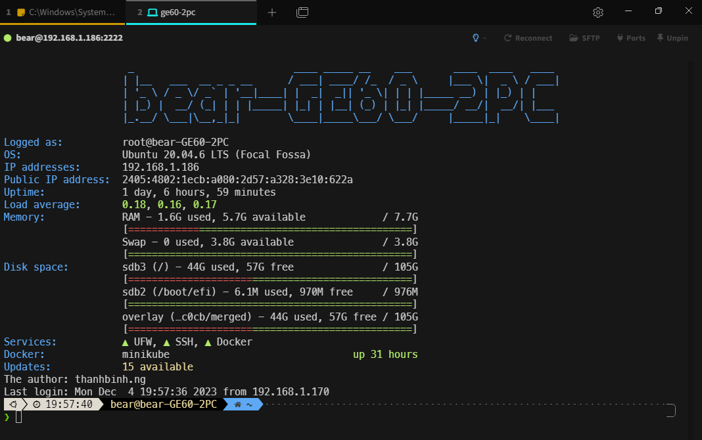
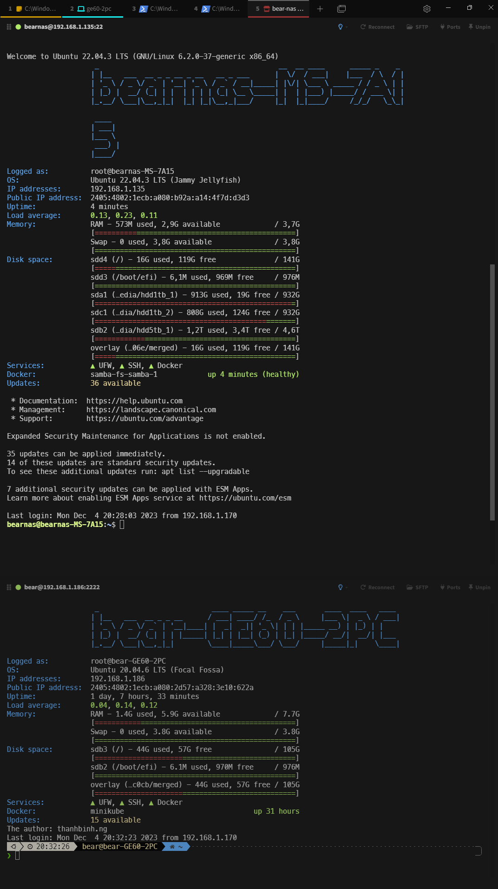

# my-motd
### firstly install packages
```
sudo apt update
sudo apt install curl
sudo apt install figlet
sudo apt install bc
sudo apt install update-motd
```

- clone this https://github.com/thanhbinh030296/fancy-motd

```
git clone https://github.com/thanhbinh030296/fancy-motd
cd fancy-motd
cp config.sh.example config.sh
```

- Copy all folder in fancy-motd to `/etc/update-motd.d`
``` 
sudo cp -r * /etc/update-motd.d
```
- rename the install.sh to 00-hostname for running this script automatically.
```
 cd /etc/update-motd.d
 sudo mv motd.sh 00-hostname
```
- Update the motd
```
sudo run-parts /etc/update-motd.d
sudo update-motd
```
### Notice that: 
 - `PrintMotd yes` in `/etc/ssh/sshd_config`
 - `UsePAM yes` in `/etc/ssh/sshd_config`


#### ***and Tada. The result :D***


